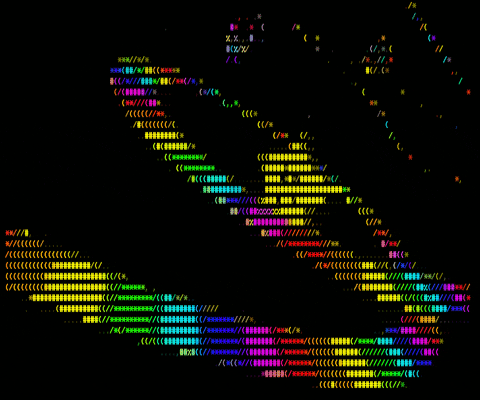

<h1 align="center">Hello  there!✌️</h1>

###

  

###

 

  
  

###

###

<h3 align="left">👩‍💻  About Me</h3>

###

I'm Victor Reis, from Brazil  - 🔭 I’m working as freelance developer - 📚 I'm currently learning AWS CloudFormation  - ⚡ In my free time I like to draw cute things

###

<h3 align="left">🛠 Language and tools</h3>

###

  
  
  
  
  
  
  
  
  
  
  
  
  
  
  
  
  
  
  
  
  
  
  
  
  

###

<h3 align="left">🔥   My Stats :</h3>

###

<!-- 

  

 -->

###
